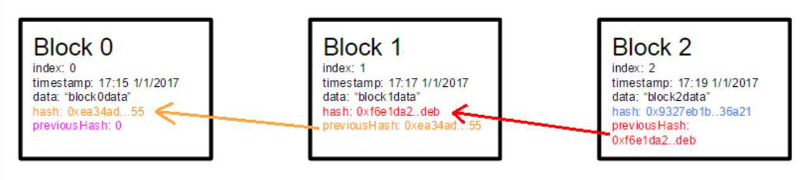
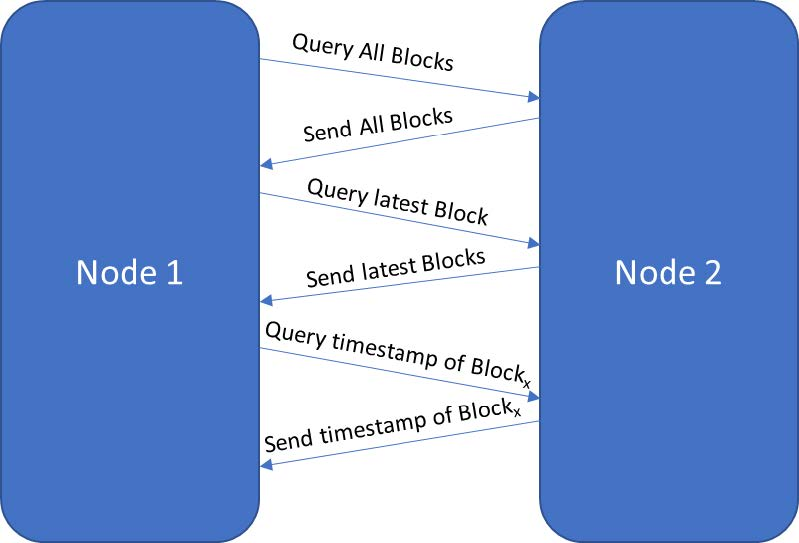

# Assignment Brief
## Background
Blockchain is an emergent technology evolving at a fast pace and there is a lot of demand in the industry for blockchain developers. Though it started off as an underlying technology for cryptocurrency transaction (e.g., Bitcoin), recent developments in blockchain have found a wider application (look for Ethereum projects) and are now being referred to as the new internet. The blockchain technology is essentially a reliable, tamperproof, distributed database of records (known as blocks), wherein all transactions/events will be executed, shared and verified by consensus among the participating parties. These blocks/records are a continuously growing list and communicate with each other through TCP sockets.

## Part I – Create a Simple Blockchain Structure
The first logical step in creating a blockchain is to decide the structure of the block. For each block include:
1. index
2. timestamp
3. data (each team members’ name)
4. hash
5. previous block’s hash (see Figure below).

In order to preserve the chain integrity, the hash of the previous block must be found in each block.

## Part II – Enable P2P Communication
The working of the Blockchain disruptive technology builds on the idea of P2P networks wherein there is no central entity, but every node in the network can trust an agreed-upon database, even though they might not know or trust each other. An essential part of P2P communication is to share and synchronize the blockchain among all the nodes/terminals.

Demonstrate the P2P communication among three nodes/terminals
1. Synchronize the blockchain among all nodes
2. Query and receive the response of the latest block between two nodes
3. Query and receive the response of the timestamp a particular block

